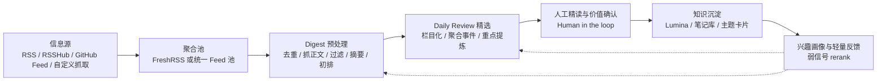

# OpenClaw 漏斗式阅读流执行计划

## 1. 目标

基于文章《信息过载时代，我的漏斗式阅读工作流》的思路，构建一套可在 OpenClaw 内稳定运行的个人阅读处理系统。该系统不追求全自动生成“看起来很聪明”的内容，而是追求以下结果：

- 尽可能广泛地接住上游信息。
- 尽可能低成本地完成预处理与初筛。
- 只把真正重要的内容送到人工精读环节。
- 把精读结果沉淀为长期可复用的知识资产。
- 用轻量反馈改善排序，但不把系统做成另一个“猜你喜欢”。

## 2. 设计原则

1. 分层处理，而不是一步到位。
2. 人在回路中，尤其是长期价值判断不能外包。
3. 个性化只做轻量 rerank，不做封闭推荐。
4. 每一层都要有清晰输入、输出和停止条件。
5. 优先保证流程稳定运行，再逐步细化反馈和工程化。

## 3. 目标架构



## 4. OpenClaw 落地方式

建议把本方案作为一个独立工作区或你目标项目中的一个子目录使用。推荐目录如下：

```text
openclaw-read-flow/
  execution-plan.md
  feeds/
  digests/
  reviews/
  knowledge/
  feedback/
  profiles/
  skills/
```

推荐产物约定：

- `feeds/`：源注册表、分类表、抓取说明。
- `digests/`：按天输出的候选集预处理结果。
- `reviews/`：按天输出的 Daily Review。
- `knowledge/`：进入精读或沉淀阶段的长期知识卡片、主题草稿。
- `feedback/`：行为信号、人工标注、负反馈记录。
- `profiles/`：兴趣画像、排序偏好、稳定高价值来源清单。

若已经搭建 FreshRSS，推荐把 FreshRSS 作为默认聚合池。此时 Digest 的直接输入不是零散 RSS 源，而是 FreshRSS 中的未读列表。

## 5. 阶段拆分与执行要求

### 阶段 A：信息源接入与归一

目标：把多来源输入统一为可持续消费的 feed 对象。

执行要求：

- 优先使用 RSS。
- 对没有原生 RSS 的来源，优先评估 RSSHub、RSS-Bridge、GitHub Feed、wewe-rss、自定义抓取。
- 为每个源记录：名称、地址、更新频率、主题、可信度、接入方式、失败兜底方式。
- 按用途给源分层：
  - 核心跟踪源：长期稳定高价值。
  - 观察源：偶尔提供价值，适合保留。
  - 机会源：事件驱动或临时跟踪。

输出：

- `feeds/source-registry.md`
- `feeds/source-groups.md`

停止条件：

- 新信息源已被归一为可复用 feed。
- 下游不需要再直接访问原网站才能理解来源结构。

### 阶段 B：聚合池管理

目标：形成一个可持续读取的中间水库，避免下游直接耦合互联网。

执行要求：

- 聚合池只负责收集、缓存、标记和时间窗口管理。
- 不在聚合层做重编辑，只保持稳定可访问。
- 保留未读窗口和更新时间边界，确保 Digest 每次都有明确处理范围。
- 若使用 FreshRSS，优先通过 Google Reader API 获取未读列表。
- 默认先全量抓取原始未读池，不限制总未读数。
- 默认在下游按“昨天”这个自然日窗口切片处理；只有用户显式指定其他日期时才覆盖。
- FreshRSS 配置至少应包含：
  - `base_url`
  - `username`
  - `api_password`
- 建议额外配置：
  - `output_json`
  - `output_md`
  - `limit`
  - `include_read`

输出：

- 聚合池本身的订阅状态和未读窗口。
- 每次 Digest 所需的“候选抓取范围”定义。

停止条件：

- Digest 可以只面对聚合池工作，不需要逐站抓取。

### 阶段 C：Digest 预处理

目标：把混乱原始候选转成“可判断对象”。

核心任务：

- 通过 FreshRSS API 获取未读列表
- 从全量未读池中切出“昨天窗口”作为默认处理集
- URL 精确去重。
- 相似事件去重或聚类。
- 正文抓取与可读性检查。
- 噪音过滤。
- 摘要生成。
- 初步排序。
- 输出结构化候选文档。

建议输出字段：

- 唯一 ID
- 标题
- 来源
- 发布时间
- 原始 URL
- 归一化 URL
- 摘要
- 主题标签
- 风险标签
- 可操作性标签
- 事件聚类 ID
- 排序理由

输出：

- `digests/YYYY-MM-DD.md`
- 如需结构化消费，可同步维护 `digests/YYYY-MM-DD.json`
- 若上游是 FreshRSS，建议先生成：
  - `digests/raw-freshrss.json`
  - `digests/raw-freshrss.md`
  - `digests/freshrss-yesterday.json`
  - `digests/freshrss-yesterday.md`

停止条件：

- Daily Review 可以在不反复打开原始网页的前提下完成精选。

### 阶段 D：Daily Review 精选

目标：把 Digest 候选转换成一份真正可读的“今日重点”。

固定栏目建议：

- 今日大事
- 变更与实践
- 安全与风险
- 开源与工具
- 洞察与数据点
- 主题深挖

执行要求：

- 合并同一事件的多个来源。
- 不重复堆砌摘要，要明确“为什么今天值得关注”。
- 优先突出公共重要性、对个人的操作价值和潜在风险。
- 对适合深挖的主题追加“后续跟踪建议”。
- 文档结构固定使用 `#` / `##` / `###` 三级标题：
  - `#` 用于整篇 Daily Review 标题
  - `##` 用于栏目区块
  - `###` 用于单个独立主题

输出：

- `reviews/YYYY-MM-DD.md`

停止条件：

- 人类读者在 5 到 15 分钟内能快速完成“今日重点”扫描。

补充约束：

- 默认不把 FreshRSS 条目标记为已读。
- FreshRSS 状态变更只能由用户显式指令触发，不能作为日报生成的隐含副作用。

### 阶段 E：人工精读与价值确认

目标：把长期价值判断留给人，而不是交给自动流程。

执行要求：

- Daily Review 只负责送达，不自动把内容写入长期知识库。
- 只有经人工确认“值得精读/值得留存”的内容，才进入沉淀环节。
- 每次确认都应记录简单理由，例如：
  - 为什么值得长期留存？
  - 未来什么场景还会用到？
  - 它影响的是认知、写作、决策还是实际实现？

输出：

- `knowledge/inbox/YYYY-MM-DD-*.md`
- 或直接进入你的 Lumina/笔记库导入格式

停止条件：

- 沉淀内容不是“我看过”，而是“我确认未来还会用”。

### 阶段 F：知识沉淀与长期输出

目标：把日常阅读流转换成复利型内容资产。

沉淀方向：

- 知识卡片：一条内容的长期结论、适用边界、引用价值。
- 周刊：一周范围内的主题复盘与噪音剔除。
- 主题文章：跨多天积累后形成专题输出。

输出：

- `knowledge/cards/`
- `knowledge/weekly/`
- `knowledge/themes/`

停止条件：

- 系统开始产生可反复引用的长期内容，而不是每天读完即丢。

### 阶段 G：兴趣画像与轻量反馈

目标：让系统稍微更懂你，但不过度迎合你。

当前建议只采集弱信号：

- 点开但未读完
- 读完但未收藏
- 值得精读
- 值得长期沉淀
- 影响了写作/决策/实现
- 明确负反馈

执行要求：

- 反馈只作为弱排序信号。
- 不允许用画像硬性屏蔽公共重要性事件。
- 每次更新画像时，保留“探索位”，防止形成信息茧房。

输出：

- `feedback/events.jsonl`
- `profiles/interest-profile.md`
- `profiles/rerank-hints.md`

停止条件：

- Digest 和 Daily Review 的前排内容更贴近长期价值，但仍保留探索性。

## 6. Skill 对应关系

本方案配套 6 个 OpenClaw skills：

1. `read-flow-orchestrator`
   - 负责总控、阶段判断、断点恢复、输入输出契约维护。
2. `source-intake-curator`
   - 负责信息源接入、归一、分组和注册表维护。
3. `digest-builder`
   - 负责预处理、去重、聚类、摘要、初排序。
4. `daily-review-editor`
   - 负责栏目化精选与日报结构整理。
5. `knowledge-distiller`
   - 负责人工精读后的沉淀模板和长期价值提炼。
6. `profile-feedback-optimizer`
   - 负责反馈信号整理、兴趣画像更新和轻量 rerank 建议。

## 7. 推荐实施节奏

### 第 1 周：跑通 MVP

- 建立源注册表。
- 确定聚合池接入方式。
- 产出第一版 Digest 模板。
- 产出第一版 Daily Review 模板。

验收标准：

- 至少能稳定从 10 到 30 个源中抽取候选。
- 每天可生成一份 Digest 和一份 Daily Review。

### 第 2 周：引入人工价值门槛

- 建立“值得精读/值得沉淀”的人工判断模板。
- 开始把少量高价值内容写入知识卡片。
- 为 Daily Review 增加“后续跟踪建议”区块。

验收标准：

- 每周至少产生 3 到 10 条可复用知识卡片。

### 第 3 周：引入反馈闭环

- 记录基本行为信号。
- 更新兴趣画像摘要。
- 将画像信号以弱权重回灌到 Digest 和 Daily Review。

验收标准：

- 画像更新后，前排内容相关性提升，但没有明显损失公共重要性内容。

### 第 4 周及以后：向周刊和主题文章扩展

- 复用一周 Digest、Review、知识卡片生成周刊。
- 识别反复出现的主题，积累专题草稿。

验收标准：

- 周刊不只是“本周发生了什么”，而能回答“哪些值得记住、哪些只是噪音、哪些值得继续跟踪”。

## 8. 关键数据结构建议

### Source Registry

建议字段：

- `source_name`
- `source_url`
- `feed_url`
- `category`
- `priority`
- `update_frequency`
- `source_type`
- `notes`

### Digest Item

建议字段：

- `item_id`
- `cluster_id`
- `title`
- `source`
- `published_at`
- `url`
- `summary`
- `key_points`
- `topic_tags`
- `actionability`
- `risk_level`
- `public_importance`
- `personal_relevance`
- `ranking_reason`

### Feedback Event

建议字段：

- `event_time`
- `item_id`
- `event_type`
- `source`
- `topic_tags`
- `value_signal`
- `notes`

## 9. 风险与应对

### 风险 1：过早追求“自动写得像人”

应对：

- 让 AI 先做结构化整理，而不是终稿创作。
- Daily Review 先追求好用，再追求文风。

### 风险 2：把画像做成封闭推荐系统

应对：

- 画像只做弱排序，不做硬过滤。
- 保留公共重要性优先级和探索位。

### 风险 3：沉淀库被“我看过的内容”污染

应对：

- 坚持人工门槛。
- 沉淀时必须写明长期价值和未来使用场景。

### 风险 4：流程文件过多，维护成本上升

应对：

- MVP 期优先维护 Markdown 文档。
- 等流程稳定后再把部分环节抽象成脚本或结构化数据。

## 10. 成功标准

这套系统是否成功，不看抓了多少文章，而看以下问题能否越来越清楚：

- 哪些内容值得进入系统？
- 哪些内容值得我花时间精读？
- 哪些内容值得长期留存？
- 哪些沉淀最终影响了我的写作、决策和实现？

如果答案越来越明确，这套 OpenClaw 漏斗式阅读流就已经开始发挥价值。

